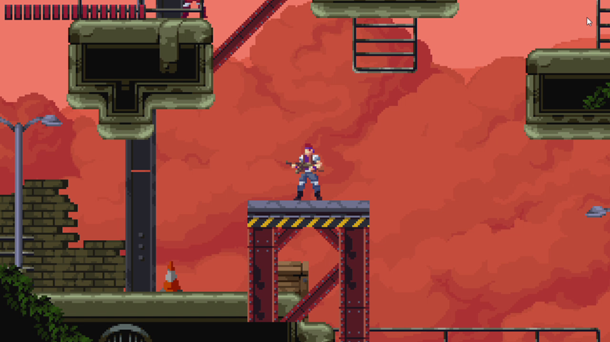
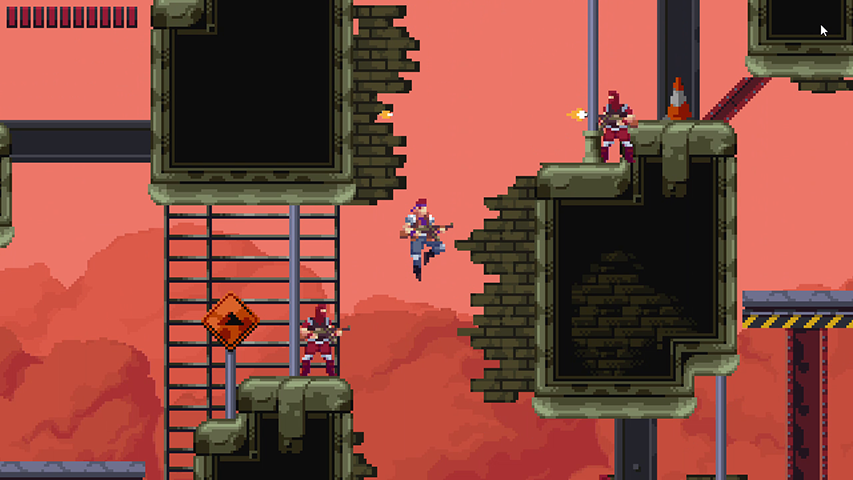

# Contra

Welcome to Contra, a classic arcade-style game developed using Pygame. In this game, players can experience the thrill of intense action as they navigate through challenging levels, firing bullets at enemies and dodging obstacles. With vibrant graphics and engaging gameplay, Contra promises an exciting gaming experience reminiscent of the retro era.

## How to Help Development

Your contributions to the development of Contra are greatly appreciated! Whether it's submitting bug fixes, suggesting new features, or improving existing code, your efforts help make this game better for everyone. Fork the repository, make your changes, and submit a pull request – together, we can take Contra to the next level!
Here are some suggestions of contributions:

- Check the opened issues, there are bugs that could be fixed or enhancement waiting for implementation.
- Help with balancing would be greatly appreciated... I'm not good in this kind of games even if I love them. - All values could be found in the tmx files wrapped in the data folder.
- Contributions for sound effects or new soundtracks would be really appreciated.

## How to Start the Game

To start playing Contra, follow these simple steps:

If you would rather run directly from the source (or want to develop the game), make sure to have Python installed and run `python -m pip install -r requirements.txt` in the repository folder.

Then you can run python `main.py` or "./main.py" (only for Python 3) in linux operating system to start the game. If you ever need to remove a module for any reason, use the command `pip uninstall (module-name)`

## Instructions

In Contra, your mission is to navigate through the level, defeating enemies and avoiding obstacles along the way. Use your arrow keys to move the player character and press the spacebar to fire bullets at enemies. Keep an eye on your health bar – take too much damage, and it's game over!

- Player can move in 2 directions left, right along with jump, duck and attack.
- The player is provided with limited health and the game may automatically close if dies.
- The enemy can fire bullets at you.
- Close the window to exit game.

## Key Controls

| Action | Primary | Secondary |
| - | - | - |
| Move left | `A` | `Left arrow`|
| Move right | `D` | `Right arrow`|
| Jump | `W` | `Up arrow`|
| Duck | `S` | `Down arrow`|
| Fire | `Spacebar` | - |

Get ready for an adrenaline-pumping experience – play Contra now!
